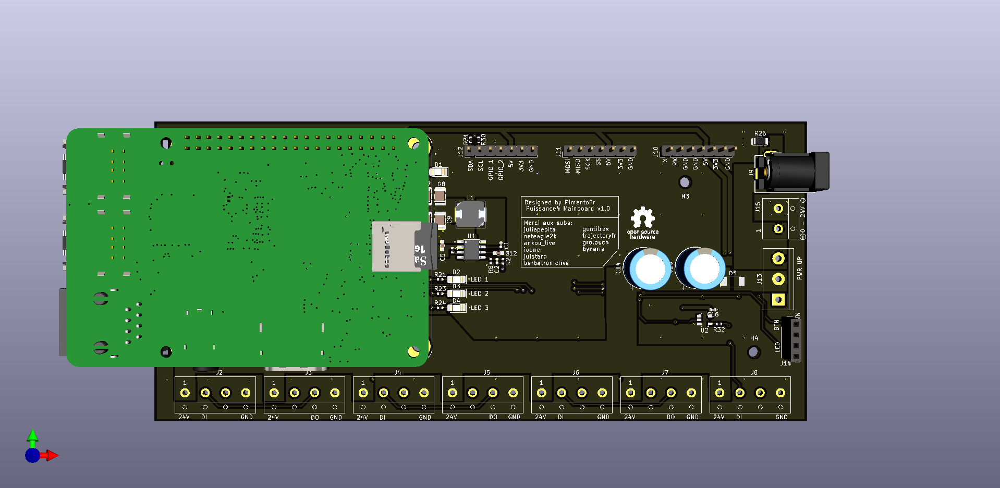

# puissance4
Il s'agit d'un puissance 4 lumineux connecté et interractif par le chat Twitch

# Description

Ce projet a pour but de réaliser un écran LED basé sur des WS2812B (led addressable individuellement), piloté par un raspberry pi
afin d'ouvrir une surface de jeu pour le puissance 4. Le jeu sera connecté et intéractif avec le chat Twitch pour permettre
aux viewers et participants de chat de jouer leur partie.

Dans ce projet, l'arborescence est la suivante:
- `hardware` : L'ensemble des documents permettant la réalisation des cartes électroniques du projet
    - `panneau_led`: Contient le design de la carte électronique des dalles de LEDs.
    - `mainboard`: Carte principale permettant l'alimentation des Bucks 24V-5V pour les colonnes de la matrice de LEDs et la connection
    du Raspberry Pi.
- `software` : Bientôt.

# Logiciels

Les logiciels utilisées sont les suivants:
- hardware : [Kicad](https://kicad.org/download/)


# Electronique

## Panneau led

Les panneaux LEDs sont des panneaux de 90x90mm qui accueille chacun 9 LEDs de type WS2812B.
Elles sont tous chaînés de la manière suivante:

```
1 -> 2 -> 3
 <--------|
4 -> 5 -> 6
 <--------|
7 -> 8 -> 9
```

## Mainboard

Cette carte permet d'accueillir la source d'alimentation (Prise Power Jack 24V 4A) et de la répartir sur 7 borniers afin d'y brancher 7 convertisseurs DC/DC Buck pour alimenter chacun des 7 colonnes de la matrice de LEDs.
A cela, un support femelle 2x20 pins permet de connnecter un
Raspberry Pi afin d'assurer l'intelligence et le pilotage de ce
panneau LEDs. Un level shifter 3.3V->5V permet d'assurer l'adaptation de niveau logique entre la commande émise par le
Raspberry Pi et les WS2812B.

Plusieurs connecteurs supplémentaires permettent de brancher
d'autres périphériques au besoin en I2C/SPI/UART.


# Licence

Le projet est open-source. Tout le monde peut l'utiliser en laissant la référence à son auteur.